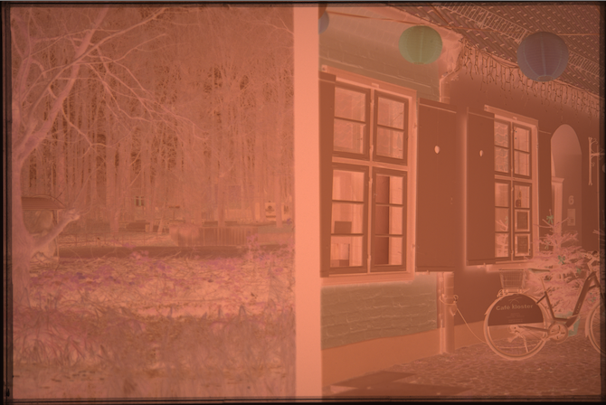
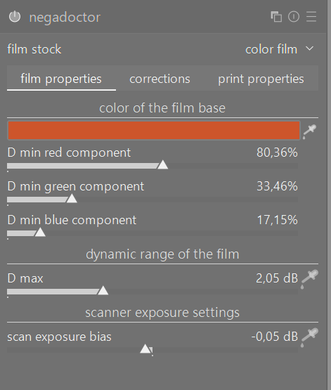
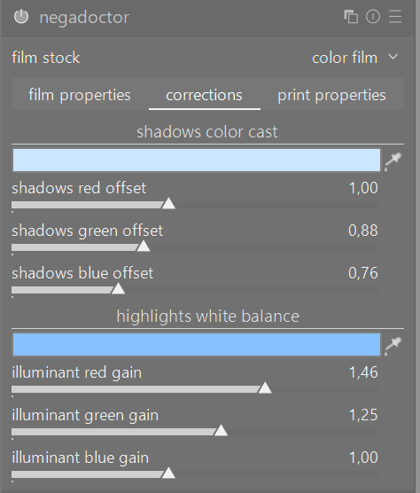
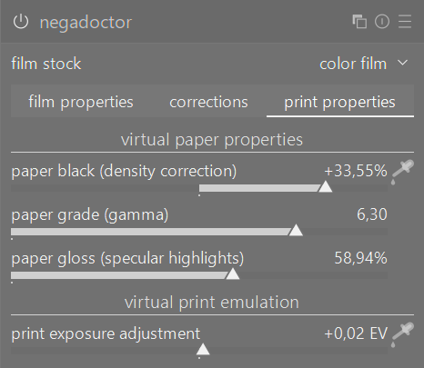

# What we are building

I shoot film photos on color negative film. Then I digitize the film by "scanning" it by making photos of the film frames with a DSLR camera with a macro lens. I place a film strip in a holder and put it before the lens and make photos of the negative frames. So for each frame we are getting a digital RAW file with that color negative photo.
I.e. it looks dark orange inverted one, so nothing like the normal final frame. Also it may (most often) have small remains of dark film holder at the edges, that should be discarded in all analysis (neighbor auto_crop feature finds that edges).

So for one film I end up with a directory of 36-37 files with individual frames of negatives in raw format (see example how it looks here - ).
Then I import that folder in darktable program which has module "negadoctor" for negative inversion.
Then I manually invert the files using the module.

It consists of steps:
- Among all the files, find the lightest film base part 
- Set that level to each frame's negadoctor setting 'color of the film base' and enable the module
- After this, frames will technically be inverted but will mostly have bad colors requiring frame by frame fixing, depending on what's in the frame. This requires setting two other negadoctor pickers, "shadows color cast" and "highlights white balance".

We now need to automate this process. In darktable, I should just be able to select freshly imported raw files of a film roll, start up an action which would export the negatives, analyze them, come up with correct negadoctor settings for each one and update the xmp files so that I can see the final inverted result in darktable.

# General requirements
- Should have the same spirit as other neighbor features, see auto_retouch for the most advanced one
- That is, should have lua + python part, debug UI, regression test suite, and so on
- Should avoid common darktable pitfalls found and accounted for in auto_retouch: accounting for darktable's mirroring, orientation, perspective corrections, cropping etc
- Original scanned frames have large dimensions (e.g. 24 megapixels), I think that the analysis can be done on much smaller exported images, e.g. 1000 pixels wide (should be a constant), for speed.
- There should be also action of removing negadoctor from history of all chosen frames, for quick erase after changing algorithm so that new run can be done afresh

# Finding the lightest film base part
Film base in a photo of a negative would be the lightest orange part of it, i.e. the place on the film which did not register any photons and remained completely transparent, that is having the color of the film base which is usually dark orange. If we take a film roll as a physical object and not think of making a photo of that negative, then film base is constant for the whole roll. Its color is the first step of color negative inversion, it sets 'base' black level in the inverted image, so the lightest 'orange' part of the film will turn black in the inverted color photo.

Note that film base should not be confused with other potential even lighter portions of a scanned frame, e.g. a backlight coming through some hole in a holder - that place would register on the photo of the negative as the _clipped_white_ patch, but we are searching not it but the lightest film base part which should be darker in color and usually orange.

Usually I make photos of all the frames of a roll with identical exposures (I'm talking about the scanning part, not about part of initially making film photos). But that may be not given. So you must take DSLR exposure differences between different frames while searching common lightest film base. Example: 
- frame 1 has exposure 1/100 and f/5.6. on it, film base candidate has average rgb density (200, 150, 10)
- frame 2 has exposure 1/50 and f/5.6. on it, film base candidate has average rgb density (200, 150, 10)
- frame 3 has exposure 1/100 and f/8. on it, film base candidate has average rgb density (200, 150, 10)
Your detection must understand that frame 2 has 1-stop exposure more over frame 1 and therefore frame 1's detected film base is actually lighter physically than frame 2's one (because despite 2x more light, frame 2 registered the same (200, 150, 10) lightest part, so in reality that lightest part is darker than frame 1's lightest part) and so frame 1's one wins the common film base choosing.
Likewise, frame 3 has 1-stop less over frame 1, but despite 2x less light, its lightest part has been detected as same density to the frame 1, so in reality the lightest part on frame 3 is actually lighter than on frame 1, so the one from frame 3 should win common film base choosing.

Additional notes:
- when accounting for exposure differences, remember that exposure is linear, but f stops are square root
- when sampling candidate film base color, remember that it's film we're dealing with and it has inherent grain so you shouldn't be taking some random pixel's color because that may be a local grain, we should be talking about some "lightest" _area_ whose color should be averaged.
- debug UI should clearly show two film base locations - the 'local' one chosen from this frame and the 'global' one choosen as the common one after analyzing all the frames and finding the lightest one among their local ones, also accounting for exposure differences.
- When found that global lightest level, you have to transfer it to each XMP's negadoctor properties, again taking backward exposure compensation if different. I.e. you have to remember exposure of the frame from which you took globally lightest film base patch and when inserting it to negadoctor properties of another frame having different DSLR exposure, account for that when pasting this global level to this local frame's negadoctor film base settings.
- In negadoctor properties, this is called 'color of the film base' ().

# Frame by frame colors/exposure correcting after base inversion
When common film base is found among the roll's frames, and we are looking at inverted image (seems like a reexport is necessary), we now need to process each frame individually and tune the following parameters in negadoctor:
- "shadows color cast" and "highlights white balance". See 
Good starting point can be had by first finding a "dark gray" part on this image and sampling "shadows color cast" from it. "Gray" is important here. 
Once that is set, then find "light gray" or "white" patch and sample "highlights white balance" from it
But then individual frames may need individual corrections. Special thing is a frame without gray stuff, e.g. all green leaves. Then you can take values from neighbour frames which have 'proper' grey patches.
It's hard to say how to choose here, it's probably the most tricky part of this feature. Maybe this process can run some local LLM model which would look at the image and categorize what it sees there and that will help your algorithm choose appropriate params (e.g. is it a day or night, winter or autumn, at home with evening lights or at daylight outside etc).
- After general hue in shadows/highlights is correct, final inverted frame exposure is tweaked at tab "print properties", mostly "paper black (density correction)" and "paper grade (gamma)" and "print exposure adjustment". See 
Generally we should choose "normal" brightness and then maximise specular highlights but without it going to heavy clipping in histogram.

Additional notes:
- Debug UI should show for each frame locations which it chosen for shadows/highlights. This frame should be displayed in already inverted form.
- Debug UI should allow moving these locations to proper places to guide fine-tuning where I will be giving you examples of badly found locations and ask you to correct algorithm
- Same about other params that you set for negadoctor module
